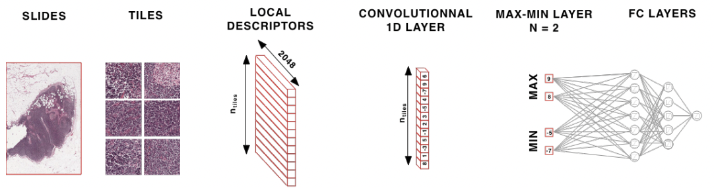
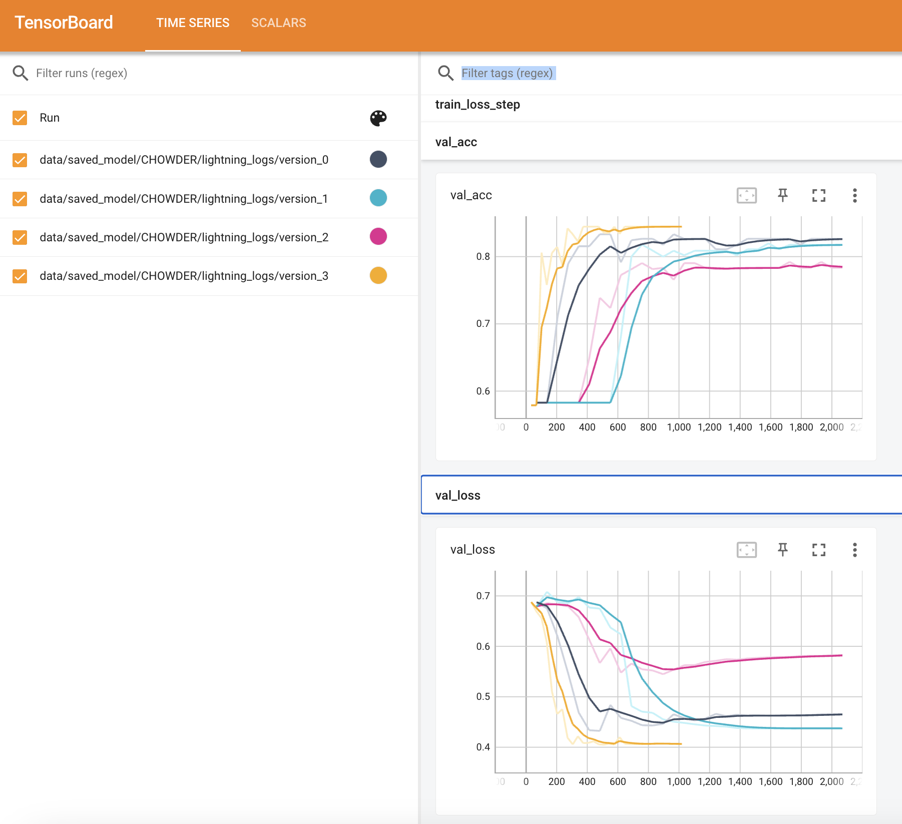
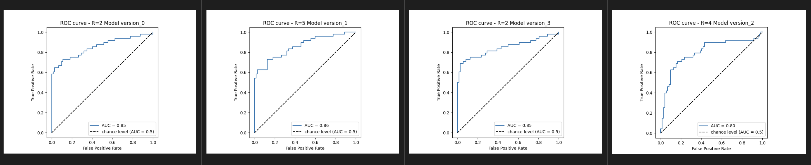

# Implementation of Chowder Model for weak supervised learning on Cancer metastases

# CHOWDER
By Pierre Courtiol, Eric W. Tramel, Marc Sanselme, & Gilles Wainrib
Owkin, Inc.
New York City, NY


This is an implementation of the CHOWDER model, initially described in [arxiv](https://arxiv.org/pdf/1802.02212.pdf)
 which defines Chowder, a deep learning algorithm adapted to weakly suprivised cases.
# Getting Started

## Environement management
In this repository, we are using [poetry](https://python-poetry.org/docs/) for dependencies management 

For local development, start by creating your virtual env using:
```bash
poetry install
```

For linting & unittest use:
```bash
poetry run black .
poetry run mypy .
poetry run pytest
```

### EC2 Instance characteristics:
For the training process, we are using an EC2 instance of type g4dn.2xlarge


# Data collection
The [data.zip](https://drive.google.com/file/d/1xji9q5GUUtca-du96LTusM6dFRfyAxP-/view?ts=641d6a21) file is downloaded from GDrive & transferred to the EC2 instance attached volume using scp command. 
```bash
scp -i <private-key> <local-path-to-data>:<file-remote-path-in-ec2>
```

`data.zip` is afterward inflated into the /data folder.


# Model Training
To launch CHOWDER model training, you can refer to the below script & specify the input arguments
```
poetry run python -m chowder_weak_supervised.lightning.experiment --n_extreme=2 --batch_size=8
```


## Launch experiment with a pre-trained model 

```bash
poetry run python -m chowder_weak_supervised.lightning.experiment --n_extreme=2 --batch_size=4 --n_epochs=10 --pretrained_model_weights "data/saved_model/CHOWDER/lightning_logs/version_0/checkpoints/epoch=6-step=483.ckpt"
```


Try `poetry run python -m chowder_weak_supervised.lightning.experiment -h` to have a complete overview of possible arguments to pass.

## Visualize training metrics using tensorboard
This project support tensorboard usage, in order to monitor your model performance, you can check it on tensorboard using 

```
tensorboard --logdir .
```
This will launch a local server accessible on [localhost:6006](http://localhost:6006/)


## Compute predictions
In order to access the `test_predictions.csv` file, you can launch below script & verify the  set of possible arguments by adding `-h` 
```
poetry run python -m  chowder_weak_supervised.evaluation.metrics --n_extreme=2 --num_workers=0 --checkpoint_path=<path_to_model_checkpoint>
```
Hint: Make sure to pass the adapted parameters with the adequate model checkpoint, otherwise model loading could fail.


## Trials 
A couple of experiments has been launched to monitor the model hyper-parameters effect on the validation metrics.

| train_accuracy | 0.903  | **0.898** | 0.922 | 0.85  |
|----------------|--------|-----------|-------|-------|
| val_accuracy   | 0.8265 | **0.844** | 0.783 | 0.817 |
|        R       |      2 |     **2** |     4 |     5 |
| BATCH_SIZE     |      4 |     **8** |     4 |     4 |
| N_EPOCHS       |     30 |    **30** |    30 |    30 |
| VERSION        |     0  |       3   |   2   |    1  |
| AUC            | 0.853  |    0.846  |  0.798| 0.859 |

We use tensorboard to monitor model performance during training.


We evaluate models perf using ROC curves & AUC values


## Execution & development using docker
You can build your own image for the project

```
docker build -f Dockerfile -t local_image/experiment/chowder_cpu:0.1 .

docker run -v /home/ubuntu/Demo/chowder_weak_supervised/data/:/opt/workspace/data/ -it local_image/experiment/chowder_cpu:0.1  bash
```

We use volume mapping to avoid overloading the docker container with training data, they can be accessed using volume mount during container launch.

You can also use the docker-compose :
```
docker-compose build
docker-compose up
```
For launching the infernece code, you need to change the module as described in app.sh file

```bash
## app.sh
#! /bin/bash
set -o errexit -o pipefail -o nounset
source ./venv/bin/activate
python -m chowder_weak_supervised.evaluation.metrics --n_extreme...
```
